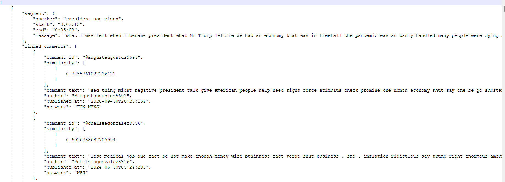

# Vibe Check
## Unraveling Political Sentiment on YouTube

### Introduction:
In the digital age, social media platforms like YouTube have become significant arenas for political discussion. With millions of users sharing their opinions, these online conversations can offer valuable insights into public sentiment, media bias, and political leanings. Over the past semester, I dedicated my efforts to Project Vibe Check, a comprehensive initiative aimed at analyzing YouTube comments, particularly around election debates, to discern what people are saying, who they support, and how they perceive media portrayals of candidates.

### The First Phase: Collecting and Analyzing Preliminary Data
The most important component of any analysis, to nobody's surprise is data. Thus the first task was to collect youtube comments. This was chosen as these comments offered a treasure trove of real-time reactions and opinions from a diverse user base. We began by collecting comments from the 2020 U.S. election debate between Joe Biden and Donald Trump, using the [Youtube API](https://console.cloud.google.com/marketplace/product/google/youtube.googleapis.com), focusing on videos from the following channels CBS News, CSPAN, FOX News, NBC, Sky News. For those interested in the data, [you can access the 2020 election comments CSV files here.](https://github.com/akash-2303/Election-Data/tree/main/Debate_2020/data/datasets) There were a lot of attributes associated with each comment that could offer a lot of insights to those interested. Below is a sample of how the CSV structure looked like.

  
 
<em>Source: CBS News 2020</em>
   

After preprocessing the CSV files for all channels, I tried performing clustering with k=3 and tabulated the summary of my cluster interpretation after reverse encoding cluster centers. 

  
 
<em>Cluster results 2020</em>
 

This is up for interpretation. Next up was extending the same pipeline for first presidential debate of 2024 between Joe Biden and Donald Trump. This time, we gathered comments from MSNBC, C-SPAN, USA Today, NBC and Wall Street Journal. We recorded the results similarly([which you can check out here](https://github.com/akash-2303/Election-Data/tree/main/Debate_2024/data/datasets)) and I performed similar analysis. The results appeared more one sided and the clusters were hard to interpret.

  
 
<em>Cluster groups 2024</em>

Notably, many comments highlighted perceived media bias, either favoring one candidate or downplaying another. This observation was crucial, as it shed light on how media outlets might influence political discourse and public perception. Fortunately [The AllSides Media Bias Chart](https://www.allsides.com/media-bias/media-bias-chart) helped display some of the bias news outlets might have. This was important not just for the analysis done so far but also for the upcoming data collection and analysis as this not only highlighted media and moderator bias but also the kind of audience each channel was more likely to pull and what their leaning could be more often than not. 

### Second Phase: Youtube Live  
A pivotal moment in Project Vibe Check was scraping live comments during the September 2024 Presidential debate between Kamala Harris and Donald Trump. Live video comments posed a significant challenge due to their constantly updating nature. Many channels also had the live chats disabled so we had to narrow down the channels that would allow the livechat to be enabled. Additionally, the risk of being rate-limited by YouTube’s API added complexity. To overcome these challenges, we utilized [`pytchat`](https://pypi.org/project/pytchat/), a Python library that enabled seamless scraping of live video comments. Setting up distributed scraping tasks across multiple ports, we successfully collected comments from several news channels simultaneously using a simple dashboard we rendered.  

  
 
<em>Dashboard of live data scrapper</em>

This allowed for extensive analysis, revealing that live comments during the vice-presidential debate showed a slight lean towards right-wing sentiments, aligning with findings from previous debates. [Analysis results are summarized in this google document](https://docs.google.com/document/d/1MTqyvx0tWhKGo0CC850WHCXRY66lbglZUITiiJxLoBo/edit?usp=sharing)

Live chat had some different attributes compared to youtube comments. First was the obvious absence of like and reply features. Apart from that there are some attributes that might hold a different weightage than they did before as these timestamps are now reflective of real time reactions. By this time the vice presidential debate was approaching so the team had a similar setup to analyze those comments as well.   

### Final Phase: Linking comments to Debate Transcripts  
So far the tasks involved collection data and performing exploratory Data Analysis. However now was the time to get my hands dirty and dig deeper. Specifically my target was to recognize each speaker’s speech, identify the topic they were discussing, and link the comments most relevant to these segments. This would provide a clearer picture of how the public reacted to specific topics and speakers during the debates. This task was approached as a two-stage problem:  

#### Stage 1: Obtaining Debate Transcripts
Whilst many online sources provided transcripts, these transcripts do not include critical elements like the timestamp. On the contrary youtube itself offered transcripts. I made sure to make use of this. First I got the audio files of the debate in .wav format and used the [pyannote/speaker-diarization](https://huggingface.co/pyannote/speaker-diarization) model. This model identified distinct speakers and assigned the appropriate dialogue to each speaker, complete with timestamps(from youtube). This nuanced diarization allowed for a detailed mapping of the debate, where each segment was accurately tagged with the respective speaker and the corresponding time.. Whilst the model performed poorly on the vice presidential debate, it was working well for the first two debates between Trump and Biden and Kamala Harris and Trump and hence I just processed those transcripts.  

#### Stage 2: Linking Comments to Debate Segments
Once the transcripts were prepared, the next challenge was linking user comments to the pertinent segments of the debate. Initially, I considered analyzing a fixed number of top comments. However, a more sophisticated approach recommended to me was using time as a measure for selecting relevant comments. To implement this, I used a time-series K-Nearest Neighbors (KNN) algorithm. The process involved vectorizing both the speaker’s remarks and the user comments. By creating a sensible time window (e.g., 10-30 seconds), the KNN algorithm calculated the cosine similarity between the speaker's comments and user responses. This method ensured that comments were not only within the correct time frame but also contextually relevant to the speaker's message. 

  
 
<em>Structure of Linked Comments</em>

I performed linking for both the presidential debates of 2024. Since these files were 6+ GB [I stored in drive](https://uflorida-my.sharepoint.com/:f:/g/personal/akashbalaji_ufl_edu/El6ZUOgjBLxElQAw0iOyPdEBqJNN7Q7bCrjts8272POVEw?e=8dONxJ) 

### Closing Thoughts
Vibe Check was an opportunity to work with wonderful people on a very interesting project exploring the intersection of politics, social media and data analysis.  Looking ahead there is so much more that can be done, like visualizing the linked comments using interactive dashboards and refining analysis to capture more granular insights. 
